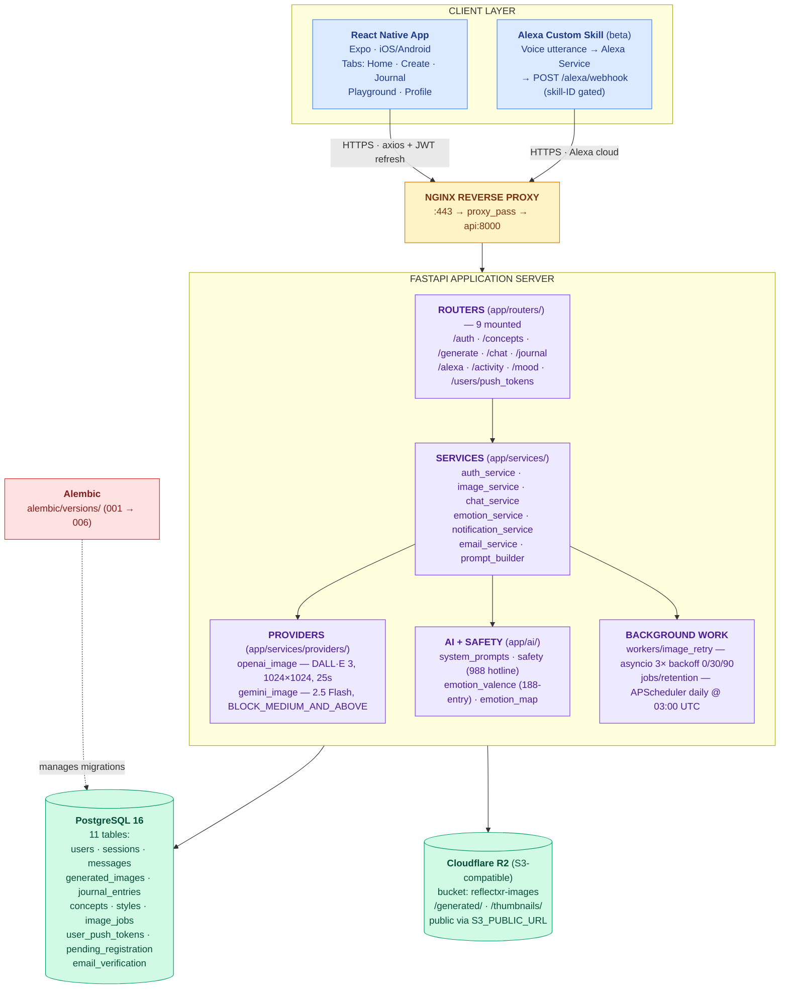

# InnerLens — ReflectXR + MindMate

**Title:** *Developing an Emotion-Based Generative AI Mobile Experience for Arts & Wellness*

**Sponsor:** Persistent Technology, Inc.

**Timeline:** 8 weeks.

ReflectXR is a cross-platform mobile app that lets users select or describe an emotion, generate AI artwork from that emotion, and reflect on the result through creative journaling. MindMate is our team's original addition — a conversational AI companion that detects emotions from natural conversation and generates art automatically, without the user ever writing a prompt.

## Demo

[](https://youtu.be/SUgvqrHv2T4)

## Requirement Traceability

Every feature maps back to the sponsor's project brief. This table is the source of truth — if something isn't checked here, it isn't done.

| # | Sponsor Requirement | Where It Lives | Status |
|---|---------------------|---------------|--------|
| R1 | Cross-platform mobile prototype (iOS + Android) | `reflectxr-mobile/` — React Native + Expo (bare workflow, `ios/` + `android/` committed) | Shipped |
| R2 | Generative AI image synthesis from text prompts | `POST /generate` → DALL·E 3 primary, Gemini 2.5 Flash Image fallback (provider race), with OpenAI Moderation gate | Shipped |
| R3 | User-friendly emotion input interface | `ConceptsScreen` → `PromptDesignScreen` → `PromptEditScreen` (dropdown-driven concept templates) | Shipped |
| R4 | Creative journaling with image reflection | `ReflectScreen` → `POST /journal` → persisted with selected image + emotion tags | Shipped |
| R5 | Emotional tagging / NLP keyword association | `emotion_service.py` → GPT-4o-mini → top-3 `{emotion, intensity}` tags stored as JSONB on every journal entry and chat message | Shipped |
| R6 | Word/image linking or tagging feature | Emotion tags rendered on `JournalListScreen` + `JournalDetailScreen`; 188-entry valence lookup feeds the `HomeScreen` mood graph | Shipped |
| R7 | Calming, reflective, accessible UI/UX design | `src/theme/` — wellness palette, generous spacing, dark mode; new cloud-mascot app icon (`com.innerlens.reflectxr`) | Shipped |
| R8 | User testing plan + insights (pilot or focus group) | `docs/user-testing/` — 3-5 testers, feedback forms | Not started |
| R9 | Documentation: architecture, APIs, setup instructions | This README + `docs/MODULE-*.md` + 15-page static HTML docs site | Complete |
| R10 | Final presentation/demo to project sponsors | `docs/presentation/` — slides + 3-min demo script | Not started |
| **Bonus** | MindMate AI chatbot (emotion → auto art generation) | `POST /chat` → GPT-4o-mini → emotion extraction → optional `POST /chat/generate-from-conversation` | Shipped |
| **Bonus** | Alexa/Echo voice integration (stretch) | `POST /alexa/webhook` — Custom Skill proxies voice to MindMate via `quick=True` mode to meet Alexa's 8-second budget. Demo-user-bound beta. | Shipped (beta) |

## Tech Stack

| Layer | Technology | Why |
|-------|-----------|-----|
| Mobile app | React Native 0.83 + Expo SDK 55 + React 19 + TypeScript | Cross-platform from one codebase. Bare workflow (committed `ios/` + `android/`) so we can ship native modules. Mohammed owns this. |
| Backend API | FastAPI (Python 3.11) + SQLAlchemy 2.0 async | Async-native, auto-generates OpenAPI docs, Python ecosystem for AI libs. John owns this. |
| Database | PostgreSQL 16 | Industry-standard RDBMS. Migrations via Alembic. |
| Object storage | Cloudflare R2 (S3-compatible, via boto3) | Generated images + 256×256 Pillow thumbnails. R2 = free egress. |
| Auth | JWT HS256 (python-jose + passlib/bcrypt) | Stateless 24h access + refresh pair. `secrets.randbelow()` + `hmac.compare_digest()` for email-verification codes. |
| AI — chat | OpenAI GPT-4o-mini | MindMate conversation + emotion extraction. |
| AI — images (primary) | OpenAI DALL·E 3 (1024×1024, 25 s timeout) | Fast, reliable primary provider. |
| AI — images (fallback) | Google Gemini 2.5 Flash Image | Picks up when DALL·E fails. `BLOCK_MEDIUM_AND_ABOVE` on all 4 harm categories. |
| AI — safety | OpenAI Moderation (pre-gen) + Gemini safety_settings (output) + local crisis-keyword scan | Three-layer gate. 988 hotline surfaced on crisis detection. |
| Email | AWS SES | 4-digit verification codes for register + email-change flows. |
| Push notifications | Expo Push Relay | Tells users when async image jobs finish. Auto-revokes `DeviceNotRegistered` tokens. |
| Scheduled jobs | APScheduler | Daily retention purge @ 03:00 UTC (drops inactive chat sessions with no journal tie-in). |
| Async workers | asyncio (in-process) | Image-gen retry loop: 3 cycles, backoffs `0,30,90` s, ≤2 min total. |
| Reverse proxy | NGINX (Docker) | SSL termination in prod. |
| Containers | Docker + Docker Compose | One `docker-compose up` for Postgres + API + NGINX. |
| CI/CD | GitHub Actions | Lint, test, build on every PR. |

## Key Capabilities

- **Two-step email-verified registration.** `POST /auth/register/request` → 4-digit code via SES → `POST /auth/register/verify` → user + JWT pair.
- **Concept-driven image generation.** `POST /generate` with concept + dropdown choice → moderation → DALL·E 3 / Gemini race → 4 images → pick one.
- **202 escalation + async retry.** Both providers fail → backend returns `202 {job_id}`, schedules an asyncio retry with backoffs `0/30/90`, sends a push on success or failure. `reconcile_stale_pending_jobs()` cleans up crashed workers at startup.
- **MindMate chat companion.** GPT-4o-mini with crisis-keyword guardrails, 10-message + 5-journal rolling context, optional auto-image generation from detected emotions.
- **Journal + mood graph.** Every journal re-runs emotion extraction on edit. Valence lookup (`+1/-1/0`) over 188 emotions drives the mood timeseries; unlocks at 3+ entries.
- **Activity + streak.** `GET /activity/dates`, `/activity/stats`, `/activity/streak` — TZ-aware day grid and current/longest streak.
- **Alexa beta.** Custom Skill → `/alexa/webhook` → skill-ID validation → demo-user-bound → MindMate chat in `quick=True` mode to stay under Alexa's 8-second turn budget.
- **Push notifications.** Expo push tokens upserted on auth, soft-revoked on logout, auto-cleaned on `DeviceNotRegistered`.
- **Immersive booking (Calendly).** External link only — `IMMERSIVE_BOOKING_URL` opened via `Linking.openURL()` from `PlaygroundHubScreen`. Not a booking system inside the app.

## System Architecture



`emotion_tags` is a JSONB column on `messages` and `journal_entries`:
`[{"emotion": str, "intensity": float}]`, max 3, sorted by intensity desc.

## Project Structure

```
InnerLens/
├── README.md                              (this file)
├── LICENSE
├── docs/                                  — module guides + sponsor deliverables
│   ├── MODULE-1-FRONTEND.md
│   ├── MODULE-2-BACKEND.md
│   ├── MODULE-3-AI.md
│   ├── MODULE-4-MINDMATE-ALEXA.md
│   ├── MODULE-5-UX-TESTING.md
│   ├── ALEXA-SESSION-LOG.md
│   ├── user-testing/
│   └── presentation/
└── reflect-xr/
    ├── reflectxr-backend/
    │   ├── app/
    │   │   ├── main.py                    # FastAPI entry, CORS, 9 router mounts, lifespan
    │   │   ├── config.py                  # Pydantic settings (DB, R2, OpenAI, Gemini, JWT, SES, Alexa)
    │   │   ├── routers/                   # HTTP layer — thin, delegates to services
    │   │   ├── services/                  # Business logic (testable, no HTTP deps)
    │   │   │   └── providers/             # DALL·E 3 + Gemini adapters
    │   │   ├── ai/                        # System prompts, safety gates, valence map
    │   │   ├── workers/                   # asyncio image-retry loop
    │   │   ├── jobs/                      # APScheduler retention job
    │   │   ├── models/                    # SQLAlchemy ORM (11 tables)
    │   │   ├── schemas/                   # Pydantic request/response
    │   │   ├── db/                        # async engine + seed (concepts, styles)
    │   │   └── utils/                     # Shared helpers
    │   ├── alembic/versions/              # 001_initial → 006_image_jobs_and_push_tokens
    │   ├── nginx/
    │   ├── tests/
    │   ├── Dockerfile
    │   ├── docker-compose.yml
    │   ├── requirements.txt
    │   └── .env.example
    │
    └── reflectxr-mobile/                  # Bare workflow — ios/ + android/ committed
        ├── src/
        │   ├── screens/                   # One file per screen, grouped by flow
        │   │   ├── auth/                  # Login, Register (two-step verified)
        │   │   ├── home/                  # HomeScreen (mood graph, streak, hero)
        │   │   ├── create/                # Concepts → PromptDesign → PromptEdit → Response → Reflect
        │   │   ├── chat/                  # MindMate (ChatScreen, ChatImageReveal)
        │   │   ├── journal/               # List + Detail + Edit
        │   │   ├── playground/            # PlaygroundHub (MindMate, Alexa, Calendly link)
        │   │   ├── alexa/                 # AlexaSetupScreen, AlexaScreen (gallery)
        │   │   └── profile/               # Profile, activity, streak, profile-image
        │   ├── components/                # Reusable UI atoms
        │   ├── navigation/                # React Navigation v8 (tabs + stacks)
        │   ├── hooks/                     # useAuth, useChat, useConcepts, usePushNotifications
        │   ├── context/                   # AuthContext, ThemeContext
        │   ├── services/                  # axios + interceptor + Expo push registration
        │   ├── theme/                     # colors, typography, spacing
        │   ├── types/                     # TypeScript interfaces
        │   └── utils/                     # formatDate, emotionColors
        ├── assets/                        # icon.png, adaptive-icon.png, splash-icon.png
        ├── ios/ReflectXR/                 # Xcode project (bundle id: com.innerlens.reflectxr)
        ├── android/                       # Android Studio project
        ├── app.json
        └── package.json
```

## Documentation Surfaces

- **`docs/MODULE-*.md`** — the five sponsor-facing module guides plus `ALEXA-SESSION-LOG.md`. Start here for narrative deep-dives.
- **Static HTML docs site** — a 15-page standalone site (Overview, Setup, Architecture, Mobile, Backend, API, AI Integration, Data Storage, Integrations, Alexa, Calendly, Workflow, Security, Contribution, Index). Dependency-free — open `index.html` in any browser. Maintained out of tree for easy hosting on Netlify / GitHub Pages.

## Getting Started

Read `docs/MODULE-1-FRONTEND.md` and `docs/MODULE-2-BACKEND.md` first for the full walk-through. The short path:

```bash
# 1. Clone
git clone https://github.com/your-org/InnerLens.git
cd InnerLens/reflect-xr

# 2. Backend — start Postgres + API + NGINX in Docker
cd reflectxr-backend
cp .env.example .env                # Fill in real API keys (OpenAI, Gemini, R2, SES, Alexa, JWT_SECRET)
docker-compose up -d
curl http://localhost:8000/health
# → {"status": "ok", "service": "reflectxr-api"}

# 3. Migrations + seed
docker-compose exec api alembic upgrade head
docker-compose exec api python -m app.db.seed

# 4. Mobile
cd ../reflectxr-mobile
npm install
# Dev on iOS simulator (bare workflow — rebuilds native code):
npx expo run:ios
# Or Android:
npx expo run:android

# 5. Tests
cd ../reflectxr-backend
docker-compose exec api pytest tests/ -v
```

**Required env vars (backend):** `DATABASE_URL`, `S3_ENDPOINT_URL`, `S3_ACCESS_KEY_ID`, `S3_SECRET_ACCESS_KEY`, `S3_PUBLIC_URL`, `OPENAI_API_KEY`, `JWT_SECRET` (rotate in prod). Optional: `GEMINI_API_KEY` (if unset, fallback disabled — both providers must succeed via DALL·E alone), `SES_SENDER_EMAIL`, `AMAZON_SKILL_ID`, `ALEXA_DEMO_USER_ID`, `IMAGE_RETRY_CYCLES` (default `3`), `IMAGE_RETRY_BACKOFFS` (default `0,30,90`).

## Team

| Name | Role | Responsibilities |
|------|------|-----------------|
| Mohammed Abdur Rahman | Mobile App Development | React Native (Expo bare workflow), cross-platform iOS/Android, NLP/emotion tagging, documentation |
| John Lizama | Backend Development | FastAPI, PostgreSQL, Docker, NGINX, authentication, Cloudflare R2 storage |
| Aahil Shaik | AI/ML Integration | OpenAI DALL·E 3 + Gemini 2.5 Flash Image provider race, GPT-4o-mini prompt engineering, content guardrails (OpenAI Moderation + crisis-keyword gate + Gemini safety_settings) |
| Terina Ishaqzai | UI/UX Design | User flows, wireframes, screen design, graphic design (cloud-mascot app icon, typography, wellness color system, dark mode) |

## Authors
- Mohammed Abdur Rahman
- Aahil Shaik
- John Lizama
- Terina Ishaqzai
